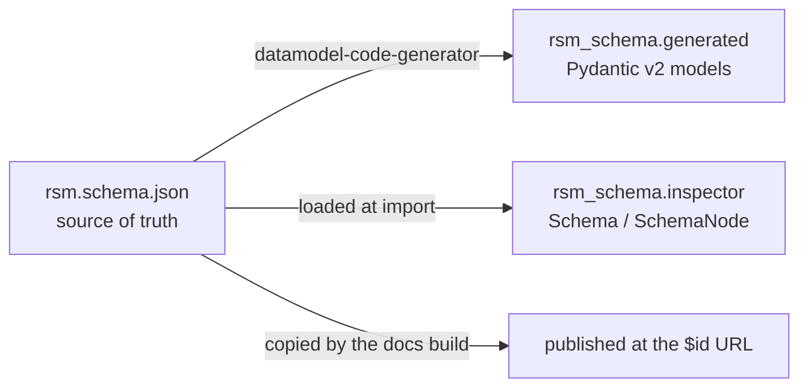

# rsm-schema

This project defines the [Research Software Management (RSM) Metadata Schema](https://lumc-dcc.github.io/rsm-schema/schema/1.0.0/rsm.schema.json)
and its Python representation.

The package includes:

- the JSON Schema itself
- generated Pydantic v2 models for validating RSM documents
- a small inspection API for traversing the JSON Schema



## Start here

- **[API reference](api.md)** — validate documents and inspect the schema from Python.
- **[Schema workflow](schema-workflow.md)** — change, generate, test, archive, and publish the contract.

## Package layers

| Layer | Purpose |
| --- | --- |
| `rsm_schema.schema` | The bundled JSON Schema file, also published at its `$id` URL |
| `rsm_schema.inspector` | Traversal, JSON Pointer lookup, local `$ref` resolution, schema validation |
| `rsm_schema.generated` | Pydantic v2 classes generated from the same JSON Schema |

## Install

```bash
pip install rsm-schema
```

Python 3.14 is required.

## Validate a document

`RSMMetadata` is the document root. Only `project_slug` is required; every other
property either defaults to an empty container or is left unset.

```python
from rsm_schema import RSMMetadata, validate_document

document = {
    "project_slug": "my-project",
    "project_name": "My Project",
    "development_status": "wip",
    "topics": {
        "entries": [
            {
                "term": "Data analysis",
                "uri": "https://edamontology.org/topic_3474",
            }
        ]
    },
    "contributors": {
        "entries": [
            {
                "name": "Ada Lovelace",
                "email": "ada@example.org",
                "roles": ["Original author", "Maintainer"],
                "affiliations": [
                    {"name": "Leiden University Medical Center"},
                    {"name": "Leiden University"},
                ],
            }
        ]
    },
}

validate_document(document)
metadata = RSMMetadata.model_validate(document)

print(metadata.contributors.entries[0].affiliations[0].name)
print(metadata.topics.entries[0].term)
```

`validate_document()` is the authoritative validation path and enforces JSON
Schema conditionals that generated Pydantic models cannot represent.

## Inspect the schema

```python
from rsm_schema import schema

schema.validate_schema()
print(schema.title)

for field in schema.root.properties:
    print(field.name, field.types, field.required)

person = schema.definition("person")
print([field.name for field in person.properties])
```

```{toctree}
:hidden:

api
schema-workflow
```
